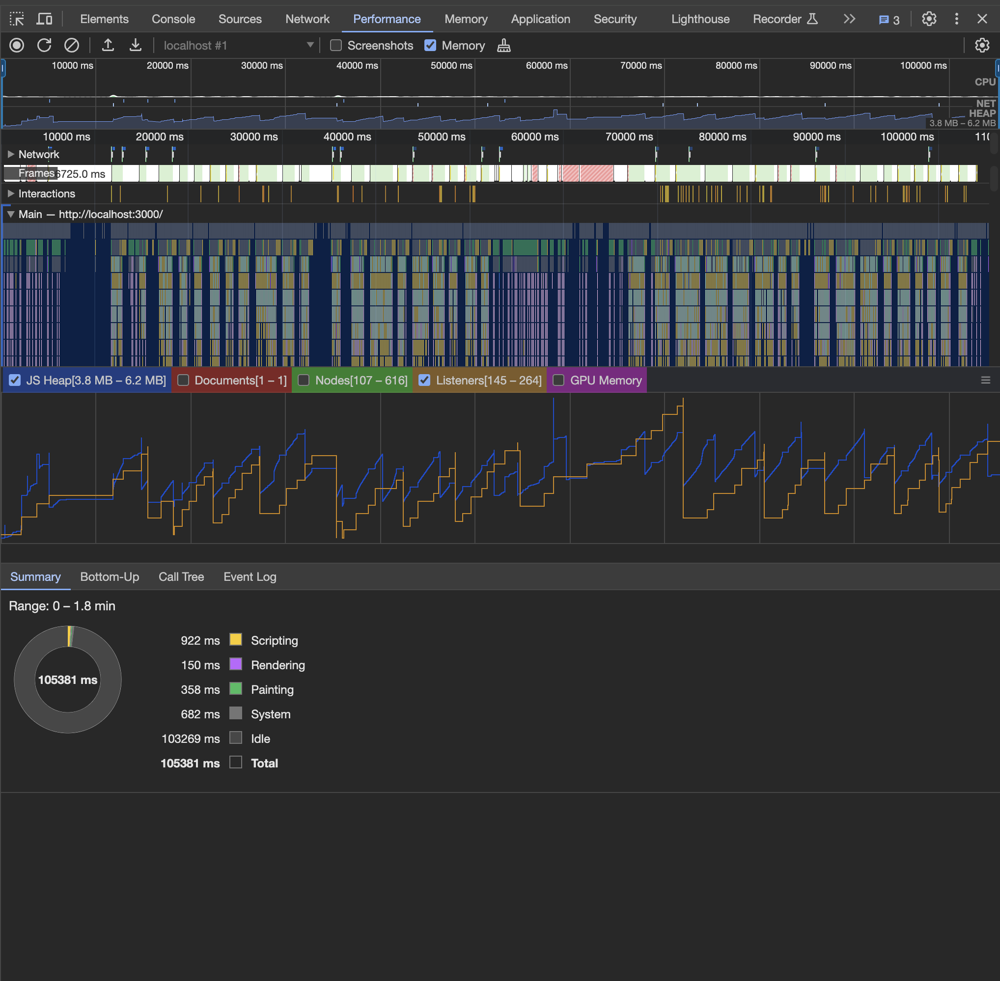

# Анализ утечек памяти

Анализ производился инструментом Chrome DevTools.

## Анализ с помощью вкладки Performance

В результатах записи можно увидеть, что размер heap меняется от 3.8MB до 6.2MB. По скачкам на нижнем графике видно, что сборщик мусора отрабатывает и JS Heap возвращается к первоначальному значению, а ненужные слушатели событий удаляются.

## Анализ с помощью вкладки Memory

Анализ производился с помощью снапшотов до и после взаимодействия с интерфейсом. Ниже представлен результат тестирования страницы профиля. На скриншоте видно, что размер снапшотов совпадает, что означает отсутствие утечек памяти.

## Выводы
На данном этапе утечек памяти не выявлено.
